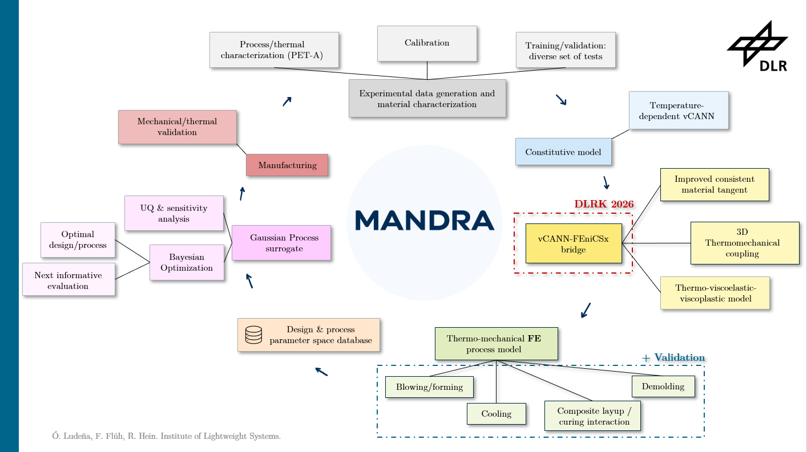

# POST-DLRK 2026

Interconnect every module from experimental data collection to the mechanical/thermal validation of the mandrels into a unique framework called MANDRA.

MANDRA stands for Manufacture-Aware Neuro-Digital Representation and Analysis.

MANDRA is a modular computational-experimental framework for the data-driven simulation, uncertainty quantification and optimization of advanced manufacturing processes.

  

## 1. How feasible it is to transfer the vCANN-FEniCSx workflow into Abaqus/b2000++ and develop MANDRA based on those?
This is important towards user-usability within the Institute of Lightweight Systems.
Advantages and disadvantages on both.

## 2. New data-collection stage: process-specific calibration for the mandrel manufacturing using PET-A

1. What do the new tests look like (i.e, which parameter space are we going to test)?