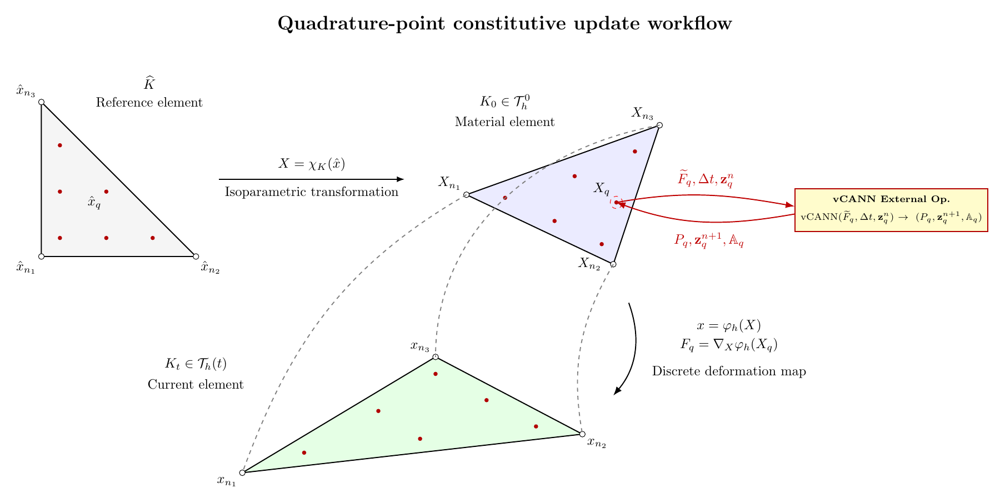
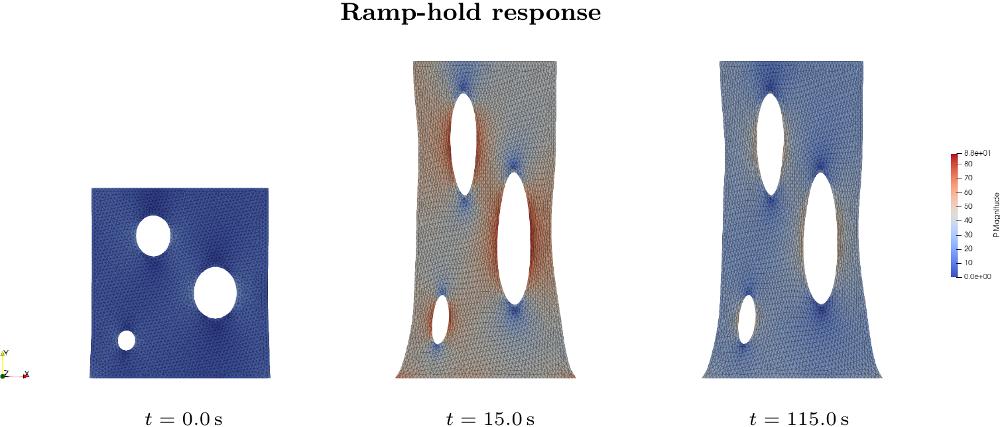
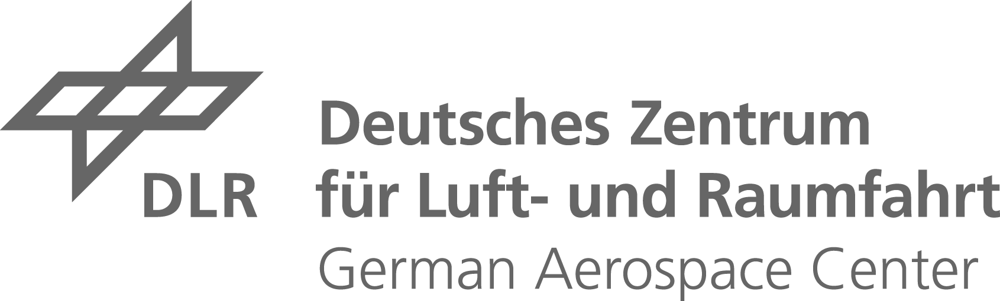

# vCANN-FEniCSx

This is the GitHub repository for the extended abstract
"Bridging Data-Driven vCANN-Based Constitutive Modelling and Finite-Element Simulation for Viscoelastic Materials",
O. Ludeña Navarro, F. Flüh, *Deutscher Luft- und Raumfahrtkongress (DLRK)*, 2026.
The link and DOI will be added here once the proceedings are published.

<p align="center">
  
</p>

This repository provides a `FEMExternalOperator` interface that embeds a pre-trained
viscoelastic Constitutive Artificial Neural Network (vCANN, Abdolazizi et al., *JCP* 2024)
into a FEniCSx/DOLFINx finite-element solve. The vCANN is evaluated at each quadrature point
as a black-box stateful constitutive law (elastic + viscoelastic + plane-stress closure), and
a consistent tangent is assembled via finite-difference probes on committed/trial state clones,
giving quadratic Newton convergence without requiring the network's native autodiff graph
inside the solve.

The included example benchmarks the framework on VHB4910 against a TensorFlow reference driver,
and demonstrates a minimal FE problem (uniaxial-loaded plate/plate-with-hole) driven by the
same vCANN evaluated through the external operator.

<p align="center">
  
</p>

## Repository structure

```text
.
├── fenicsx/
│   ├── bridge/
│   │   ├── vcann_local_step.py          # loads the trained checkpoint; one-step constitutive update
│   │   ├── verify_viscoelastic_numpy.py # NumpyVCANN: pure-NumPy forward pass (TF-free at solve time)
│   │   ├── vcann_external_operator.py   # VCANNStressOperator: FEMExternalOperator wrapper (eval_P, eval_dPdF)
│   │   ├── verify_ufl_energy.py         # elastic energy: UFL vs. TF reference
│   │   ├── plane_stress.py              # scalar Newton on F33 for the plane-stress closure
│   │   ├── toy_compressible_step.py     # compressible Neo-Hookean fixture with analytic tangent
│   │   ├── histories.py                 # deformation-gradient histories for the drivers
│   │   └── tests/                       # patch test, plane-stress tests, transient replay
│   ├── models/
│   │   ├── embedded2d_vcann_extop.py    # example FE problem using the external operator
│   │   ├── embedded2d_vcann.py          # predecessor: frozen Neo-Hookean tangent
│   │   ├── convergence_study.py         # mesh-refinement study (Richardson extrapolation)
│   │   ├── newton_convergence_study.py  # frozen vs. consistent tangent residual histories
│   │   ├── kinematics.py, materials.py  # UFL kinematics and placeholder laws
│   │   └── plot_*.py, plotstyle.py      # figure generation
│   ├── meshes/
│   │   └── unitsquare_hole.py           # Gmsh plate-with-holes generator (curved P2)
│   └── docs/                            # environment troubleshooting, ParaView notes
├── vcann/                               # vendored upstream vCANN (own LICENSE + UPSTREAM.md)
├── figures/                             # figures used in the paper and this README
├── requirements.txt                     # training environment (.venv, TensorFlow 2.10 / Keras 2)
└── requirements-bridge.txt              # FE bridge environment (.venv-bridge, Keras 3)
```

## Requirements (tested with)

The vCANN training stack and the FEniCSx stack have incompatible dependency sets
(TensorFlow 2.10 / Keras 2 vs. Keras 3), so they need **two separate virtual
environments**. Only the FE bridge is needed to reproduce the results below.

`.venv-bridge` is a `--system-site-packages` venv over an apt-installed DOLFINx;
only `tensorflow` and `dolfinx-external-operator` are pip-installed on top.
Do **not** pip-install the FEniCSx packages over the system ones — two importable
`ufl` implementations is a known failure mode
(see [`fenicsx/docs/ENVIRONMENT_TROUBLESHOOTING.md`](fenicsx/docs/ENVIRONMENT_TROUBLESHOOTING.md)).

```text
python==3.12.3
fenics-dolfinx==0.10.0.post2      # from apt, with basix 0.10.0.post0 / ufl 2025.2.1 / ffcx 0.10.1.post0
dolfinx-external-operator==0.10.1
mpi4py==3.1.5
petsc4py==3.19.6
gmsh==4.12.1
numpy==1.26.4
tensorflow==2.21.0                # weight loading only, not required at solve time
keras==3.14.1
matplotlib==3.6.3
```

```bash
sudo apt install fenicsx python3-dolfinx python3-dolfinx-real \
    python3-petsc4py python3-mpi4py

python3 -m venv --system-site-packages .venv-bridge
.venv-bridge/bin/pip install --upgrade pip
.venv-bridge/bin/pip install -r requirements-bridge.txt
```

## Usage

All commands are run from the repository root.

```bash
# Generate the plate-with-holes mesh
.venv-bridge/bin/python -m fenicsx.meshes.unitsquare_hole

# Verify the constitutive path against the TensorFlow reference driver
.venv-bridge/bin/python fenicsx/bridge/verify_ufl_energy.py
.venv-bridge/bin/python fenicsx/bridge/verify_viscoelastic_numpy.py

# Run the FE example: displacement ramp followed by a constant-strain hold
.venv-bridge/bin/python fenicsx/models/embedded2d_vcann_extop.py \
    --u-top 0.1 --n-ramp 5 --n-hold 5 --dt 1.0 --snes-monitor

# Same solve on the plate-with-holes mesh
.venv-bridge/bin/python fenicsx/models/embedded2d_vcann_extop.py \
    --mesh fenicsx/meshes/unitsquare_hole.msh

# Tests
.venv-bridge/bin/python fenicsx/bridge/tests/test_patch.py
.venv-bridge/bin/python fenicsx/bridge/tests/test_plane_stress_toy.py
.venv-bridge/bin/python fenicsx/bridge/tests/test_transient.py
```

Results are written to `fenicsx/results/` as an XDMF time series (displacement and
projected first Piola–Kirchhoff stress) readable in ParaView.

## Citation

This repository builds on the vCANN formulation introduced in:

```bibtex
@article{Abdolazizi2024,
  title   = {Viscoelastic constitutive artificial neural networks (vCANNs) -
             A framework for data-driven anisotropic nonlinear finite
             viscoelasticity},
  journal = {Journal of Computational Physics},
  volume  = {499},
  pages   = {112704},
  year    = {2024},
  doi     = {https://doi.org/10.1016/j.jcp.2023.112704},
  author  = {Kian P. Abdolazizi and Kevin Linka and Christian J. Cyron}
}
```

The upstream implementation vendored in [`vcann/`](vcann/) comes from
[ConstitutiveANN/vCANN](https://github.com/ConstitutiveANN/vCANN) and keeps its
own MIT license; see [`vcann/UPSTREAM.md`](vcann/UPSTREAM.md).

## Authors and Contributors

This vCANN-FEniCSx framework is provided by the
[DLR Institute of Lightweight Systems](https://www.dlr.de/sl).



Deutsches Zentrum für Luft- und Raumfahrt, Lilienthalplatz 7, 38108 Braunschweig, Germany

## Contact

If you have any questions, please feel free to contact <oscar.navarro@dlr.de> or open an issue.
